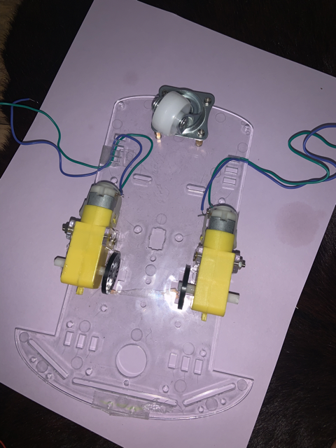
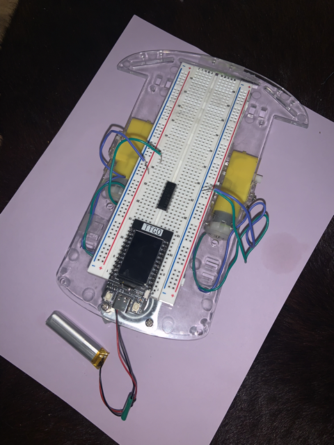
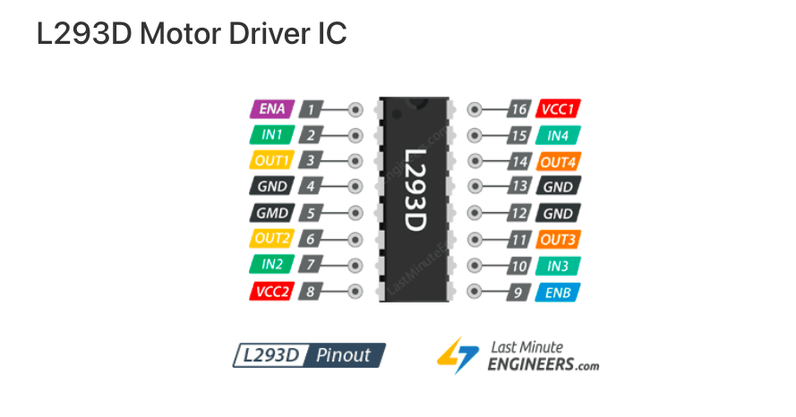
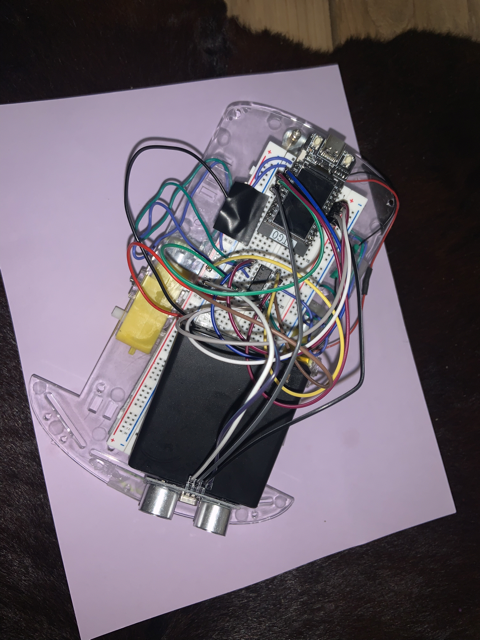

# wacky_wagon_creative_embedded_systems

## Materials

 - ESP32 
 - computer
 - USB-C 
 - 4x AA battery box with wires
 - battery 
 - 2 DC Brush motors 
 - L293D Driver
 - wheel attachments
 - car base 
 - breadboard 
 - female to female wires 
 - distance sensor 

### Setup Arduino 

- Download and open the Arduino IDE ([Download](https://www.arduino.cc/en/software))
- Open Preferences 
- Copy and paste the following link ([https://dl.espressif.com/dl/package_esp32_index.json](https://dl.espressif.com/dl/package_esp32_index.json)) into `Additonal Boards Manager URLs` to add the ESP package
- Select `Tools > Boards > Boards Manager`, then search for `esp32` and install the most recent version
- Select `Tools > Boards > ESP32 Arduino > TTGO T1`
- Select `Tools > Manage Libraries`, then search for `TFT_eSPI` and install the most recent version
- In your file storage system, find the Arduino folder
- Open `Arduino/libraries/TFT_eSPI/User_Setup_Select.h`
- Comment out the line that says `#include <User_Setup.h>`
- Uncomment the line that says `#include <User_Setups/Setup25_TTGO_T_Display.h>`

### build this project 
at the following link you can find the car chasis, motors, and wheels that I purchased for this project. 
([EMO Smart Robot Car Chassis Kit with Motors, Speed Encoder and Battery Box for DIY](https://www.amazon.com/Smart-Chassis-Motors-Encoder-Battery/dp/B01LXY7CM3/ref=sr_1_5?crid=2RKNTAZ1P29W4&keywords=car+base+and+motor&qid=1650574572&sprefix=car+base+and+motor+%2Caps%2C169&sr=8-5))

and you can find the distance sensors at this link ([Smraza 5pcs Ultrasonic Module HC-SR04 Distance Sensor with 2pcs Mounting Bracket for Arduino R3 MEGA Mega2560 Duemilanove Nano Robot XBee ZigBee](https://www.amazon.com/Smraza-Ultrasonic-Distance-Mounting-Duemilanove/dp/B01JG09DCK/ref=sr_1_1_sspa?keywords=Distance+Sensor&qid=1652325939&sr=8-1-spons&psc=1&spLa=ZW5jcnlwdGVkUXVhbGlmaWVyPUFSVVU0V09XTUVMMlcmZW5jcnlwdGVkSWQ9QTA3MDk5MTAyREVDUkNJQ0kwUzIwJmVuY3J5cHRlZEFkSWQ9QTA0MjIwMTIyM0tIMTVOR0tTSUlBJndpZGdldE5hbWU9c3BfYXRmJmFjdGlvbj1jbGlja1JlZGlyZWN0JmRvTm90TG9nQ2xpY2s9dHJ1ZQ==))

the first thing that I did was solder wires to the motors that I was going to use. Feel free to make them longer than you think necessary because you can always cut the wires to make them shorter. Then it was time to put together the car chasis. I will note that I did not use the switch or the battery pack that the amazon kit includes. The kit comes with instructions but I followed ([this](https://youtu.be/lgCERugoVL4)) youtube video to get a better idea of what to do. 

I had trouble getting the wheels to stay on so I would recommend that you use glue or another adhesive to make sure they are secure. 

after the wheels are in place you can secure the breadboard to the base of the car. I used folded construction paper so that I could have a flat base for the breadboard. Insert the esp32 and the L293D chip like so: 

. 

| <b>Wheels not pictured</b>|

### pins 

once that was set up I had to get the wires in the correct place. I used a combination of female-female wires and handcut wires. If you want a cleaner look I would suggest that you cut your wires to size. 

. 

// Motor A connections. 

in1 = pin 26      
in2 = pin 33      
enA = pin 25  

// Motor B connections. 

 enB = pin 13  
 in3 = pin 12  
 in4 = pin 15  
  
connected to wires soldered onto motors:    
motor A   
out1, out2, 

motor B   
out3, out4 

the pins that are GND do not all need to be connected to ground 
I connected 1 pin on the left side and 1 pin on the right side to a common ground 

pin 16 VCC1 is recieving power from the esp32 5V pin 
and pin 8 VCC2 is recieving power from the external battery's red wire (note that the external battery must share a common ground with the esp32) 

when connecting these wires on the breadboard you should know that ground (the black wire) gets connected to (-) 
and power (from the esp32 5v pin) is connected to (+) 

the ground and power along the edge of the breadboard does not extend all of the way. I made sure to keep wires that were accessing ground and power on the first half of the breadboard. An alternative would be to bridge both sides of the breadboard by connecting power to power, and ground to ground from the first half to somewhere in the second half. 

the distance sensor    
has a trig pin that is connected to pin 2.  
and an echo pin that is connected to pin 32.  
gnd and vcc should be connected to ground and power 

I taped the battery pack in place and used it as a support for my distance sensor

### upload and connect 
once everything is in place use your usbc cord to upload the code to the esp32   
push the reset button on the esp32 to start the server   
you should see "ESP32" as a wifi network option    
connect to the network on a phone, laptop, or tablet   
you will be prompted to put in the password which is "12345678"   
using that same device open a browser window and head to 192.168.1.1     
you should see the landing page for Wacky Wagon 

